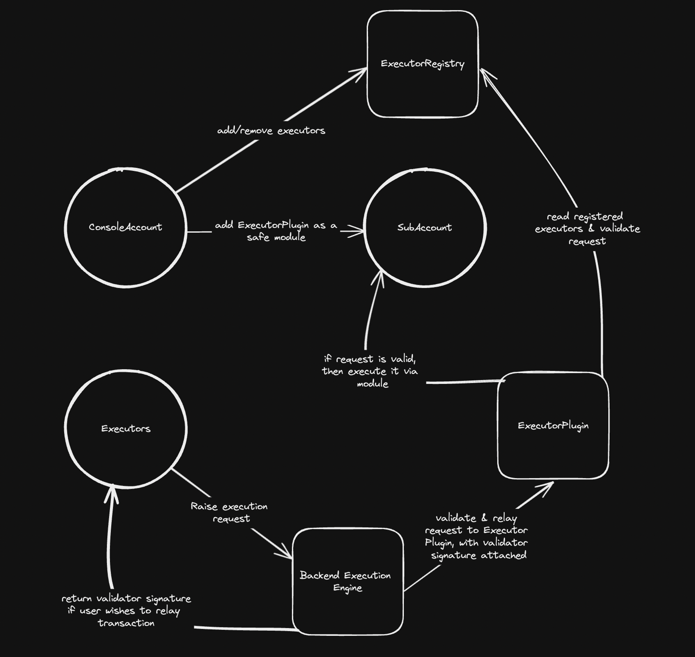

# Execution API

### Introduction

Console V2 provides access control to its users by providing the ability to securely and with minimal trust, delegate the handling of funds to another set of operators. This is done so by setting up a sub-safe with the said set of operators/delegatees and then allocating funds, and setting up policies to secure it. This allows the delegatees to perform any actions with the funds allocated as long as they are abiding by the policies set up by the main console account.

However, these delegatees are a multisig, and thus any action needed to be performed by one of them must be signed off by everyone else and this is slow and unsuitable for high frequency execution. This way of executing is also not viable for programmatic execution (for ex. via an api) as it requires the multisig signatures to be collected first before relaying is possible, which is asynchronous and slow in the real world.

The Execution API aims at solving this problem by creating another set of users called `executors`, who have the ability to override the multisig by performing safe module executions on the delegated sub-safes, given they abide by the set up policy.

### [API REFERENCE](https://brahmafi.notion.site/3rd-Party-API-Reference-bef32a96b48d40458f8d07c790e7cae3)

### Goals

What will this feature achieve?
→ Allows delegatees to perform high frequency execution, which improves execution speed & UX for critical ops
→ Allows programmatic execution using the delegated funds, which enables users to efficiently run their own automations etc.

### Dependencies

- solidity - registry and module plugin for execution
- backend - endpoints for handling executors & execution requests
- frontend - UI for managing executors & raising execution requests

### Flow

- This is the expected workflow to execute transactions as an executor -
  (diagram assumes that the guard/fallback handler etc. & other setup required for delegated subAccount are already in place)

### Contracts

- Interactions with the contracts, mainly `ExecutorRegistry`, is required for managing executors.
- Direct user interactions -
  - `registerExecutor()` on `ExecutorRegistry`
  - `deRegisterExecutor()` on `ExecutorRegistry`
